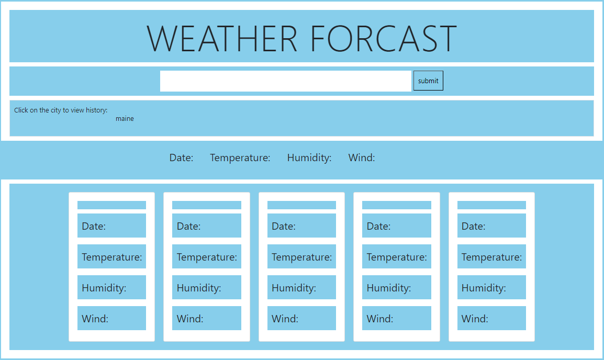

# Weather Forcast

# Description
This weather forcast is designed to produce the weather for any city un the US. The weather will give you an icon of what the weather is like. If the weather is sunny, it will display a sun. If it is rainy it will produce rain clouds. It also will show you a 5 day weather forcast for when you want to plan out your week. Humidity is also added. Wind speed is also added for those who would like to fly a kite. 

Link:https://liex149.github.io/weather-dashboard/ 

# Installation
N/A

# Usage
When a user is on the site, the user can type in their city name then click submit. Once clicked it will display the weather for that specific city for the next 5 days. There is also a history button for those who would like to keep that specific city stored so they do not need to type it in every time they want to check the weather for that city. When someone types in a city wrong, they will be alerted to make sure that the spelling is correct. 

# Credits
N/A

# License
N/A

# Badges
N/A

# # Features
N/A

# How to Contribute
N/A

# Tests
N/A
